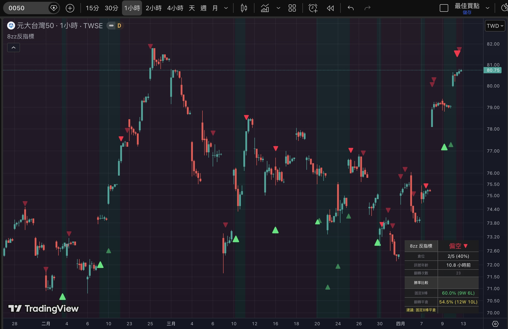

# 8zz 巴逆逆反指標 (8zz Banini Reverse Indicator)


> **免責聲明：本指標僅供娛樂參考，不構成任何投資建議。**
> © hansai-art | [Mozilla Public License 2.0](https://mozilla.org/MPL/2.0/)

---

## 簡介

「8zz 反指標」是一個 TradingView 指標，。

它記錄了巴逆逆（8zz）在 Facebook 公開發文的買賣操作，並以**反向信號**呈現在 K 線圖上。

核心哲學：**她停損賣出 → 指標偏多 ▲；她買進抄底 → 指標偏空 ▼。**

從過去 500 則訊息挑選 **63 筆**真實 FB 貼文操作，時間橫跨 2025/12 ~ 2026/04。

---

## 回測截圖（0050 · 1小時線）



> **關於勝率**
>
> 上圖在 0050（元大台灣50）上的固定8棒勝率最高約 **60%**。
>
> 這不是指標不準，而是因為 8zz 喊的大多是**個別股票**（鈦昇、旺宏、白銀、記憶體股等），拿 ETF 來對照本來就會被稀釋。
>
> **用在她實際操作的個股上，勝率更高。**
>
> 指標顯示的方向如果有誤，那是指標的錯，是川普的錯，吃土鋁繩巴逆逆是不會有錯的。

---

## 功能特色

| 功能 | 說明 |
|------|------|
| **方向箭頭** | 翻轉時於 K 棒上/下方顯示箭頭標籤 ▲ / ▼ |
| **訊號強度** | 依據用語情緒分三級：★★★ 強 / ★★☆ 中 / ★☆☆ 弱，對應箭頭大小 |
| **背景色帶** | 偏多期間淡綠底、偏空期間淡紅底（可開關） |
| **加倉箭頭** | 同方向重複訊號可選顯示（預設關） |
| **Tooltip** | 懸停箭頭查看原始貼文摘要、標的、FB 發文時間 |
| **資訊面板** | 右上/右下顯示方向、倉位、訊號年齡、翻轉次數 |
| **雙模式勝率** | 固定N棒 vs 翻轉平倉，兩種勝率對比 + 建議 |

---

## 訊號強度分級

| 強度 | 對應用語 | 箭頭大小 |
|------|----------|----------|
| ★★★ 強 | all in、停損、畢業、認賠、虧損X位數、漲停跌停 | `size.huge` |
| ★★☆ 中 | 買進、加碼、賣出、減碼、被套 | `size.large` |
| ★☆☆ 弱 | 觀望、考慮、持有、看多看空但未行動 | `size.normal` |

---

## 操作邏輯

```
1. 她買進 / 加碼 / 被套 / 看多  →  指標偏空 ▼，做空 20%
2. 她停損 / 賣出 / 畢業 / 認賠  →  指標偏多 ▲，做多 20%
3. 同方向每出現一次訊號，加倉 20%，最多 5 次（100%）
4. 出現反轉訊號  →  立刻全平 + 反手建倉 20%
5. 指標有效期約 1~3 天（可調整觀察窗）
```

---

## 事件資料

| 項目 | 內容 |
|------|------|
| 筆數 | 63 筆 |
| 期間 | 2025/12/03 ~ 2026/04/10 |
| 來源 | FB 公開貼文（巴逆逆 8zz） |

每筆事件含：時間戳、方向（偏多/偏空）、強度（1~3）、Tooltip 原文摘要

---

## 參數設定

### 顯示

| 參數 | 預設 | 說明 |
|------|------|------|
| 箭頭距離 (ATR倍數) | `0.5` | 箭頭與 K 棒距離，建議 0.3~0.8 |
| 顯示加倉箭頭 | `關` | 同方向訊號顯示額外箭頭 |
| 顯示背景色帶 | `開` | 偏多淡綠 / 偏空淡紅 |
| 顯示資訊面板 | `開` | 右上/右下統計面板 |
| 資訊面板位置 | `右上` | 可切換右下 |

### 回測

| 參數 | 預設 | 說明 |
|------|------|------|
| 固定觀察K棒數 | `5` | 模式A：翻轉後固定N根K棒結算勝敗 |

---

## 安裝方式

1. 開啟 [TradingView](https://www.tradingview.com) → Pine Script 編輯器
2. 複製 [`8zz-indicator.pine`](./8zz-indicator.pine) 全部內容
3. 貼入編輯器 → 儲存 → 加到圖表
4. 建議在可見性中取消勾選**日、週、月**，只保留秒、分鐘、小時

---

## 檔案結構

```
8zz-TradingView-Contrarian-Indicator/
├── 8zz-indicator.pine       # Pine Script v6 原始碼（63筆事件）
├── 8zz-indicator-spec.md    # 完整規格文件
├── assets/
│   └── backtest-0050.png    # 回測截圖（0050 · 1H）
└── README.md
```

---

## 授權

本專案採用 [Mozilla Public License 2.0](https://mozilla.org/MPL/2.0/) 授權。
