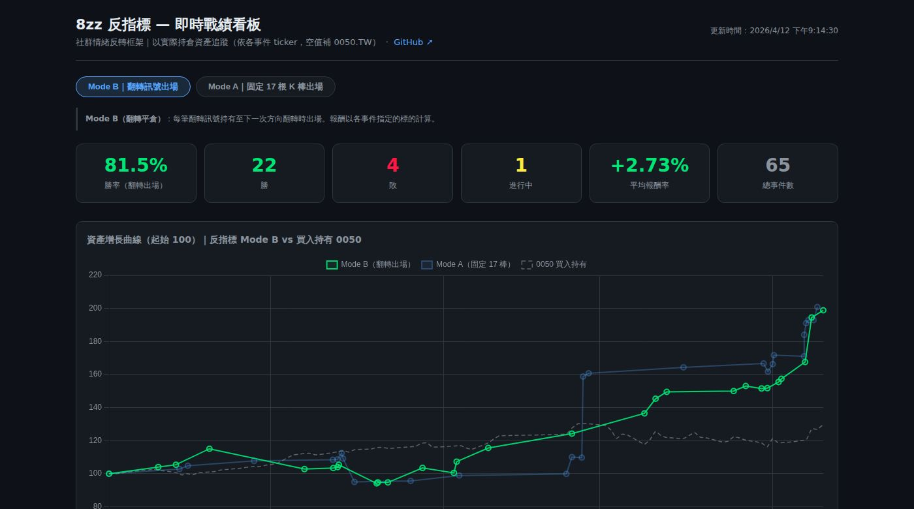
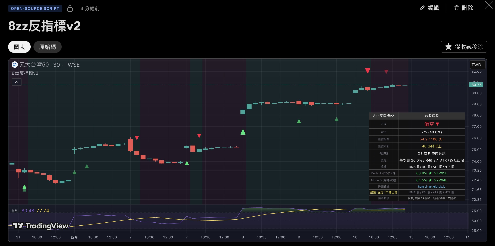
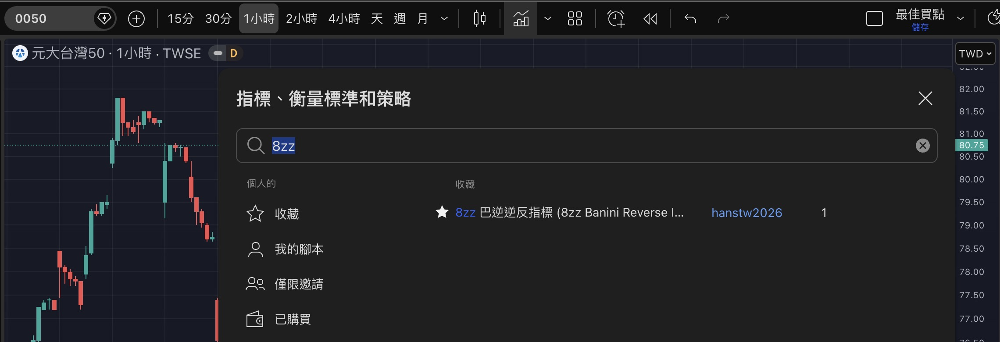
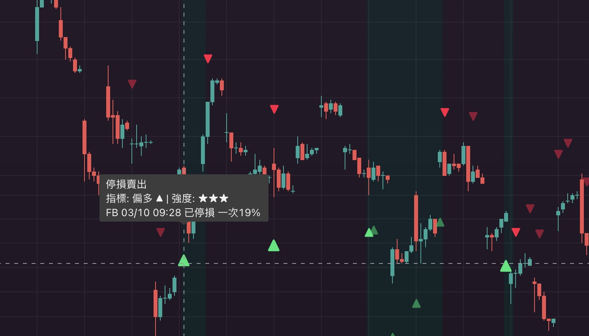

# 8zz 巴逆逆反指標 (8zz Banini Reverse Indicator)

> **免責聲明：本指標僅供娛樂參考，不構成任何投資建議。**  
> © hansai-art | [Mozilla Public License 2.0](https://mozilla.org/MPL/2.0/)

---

## 這是什麼？

**「別人恐慌時貪婪，別人貪婪時恐慌。」**

本指標追蹤巴逆逆的發文情緒，並以**逆向思維**產生買賣訊號：

| 巴逆逆情緒 | 指標方向 | 背後邏輯 |
|-----------|---------|---------|
| 恐慌、被套、停損、痛苦 | 偏多 ▲ | 散戶最恐慌的時刻 = 底部附近 |
| 追漲、自大、歡呼 | 偏空 ▼ | 散戶最亢奮的時刻 = 頂部附近 |

> **核心原則：情緒 > 動作。** 就算他正在買進，但情緒是痛苦與被套，指標仍偏多▲。

---

## 📊 即時戰績看板

**👉 [hansai-art.github.io/8zz-Contrarian-Indicator-TradingView](https://hansai-art.github.io/8zz-Contrarian-Indicator-TradingView/)**

書籤這個頁面就夠了，每日自動更新，不需要手動追蹤。

### 目前戰績

| 模式 | 勝率 | 勝 / 負 |
|------|------|---------|
| **Mode B（翻轉平倉）** | **81.5%** | 22W / 4L |
| Mode A（固定 17 根 30 分鐘K棒出場） | 80.8% | 21W / 5L |

> **Mode B**：下一個方向翻轉訊號出現時平倉  
> **Mode A**：進場後固定持有 17 根 30 分鐘K棒出場（≈ 8.5 小時 ≈ 2 個台股交易日）

---

## 實戰截圖

## 如何加入 TradingView

> ⚠️ 本指標為**私人指標**，無法直接在公開搜尋欄找到。必須先透過以下連結將其加入收藏，才能在圖表中使用。

**步驟：**

1. 開啟指標頁面：**[tw.tradingview.com/script/IbVmSqfj/](https://tw.tradingview.com/script/6pVuUMS1/)**
2. 點擊「加到最愛」（☆ 收藏）
3. 回到圖表 → 開啟指標搜尋 → 切換到「收藏」分頁 → 搜尋 **8zz** 即可找到

> 建議使用 **30 分鐘或 1 小時線**，與事件時間顆粒度最吻合。

---

## 訊號怎麼看？

圖表上每個事件會顯示：

- **▲ 偏多**（綠色向上箭頭）：看漲偏多，可考慮買進或持有
- **▼ 偏空**（紅色向下箭頭）：看跌偏空，可考慮減碼或觀望
- **★☆☆ / ★★☆ / ★★★**：訊號強度，星星越多情緒越極端
- **Tooltip**：懸停或點擊可見原始 FB 發文摘要

方向翻轉（上一個訊號與這次不同）才是關鍵進場點，標記為**翻轉訊號（Flip）**並納入勝率統計。

---

## 參數調整

| 分組 | 參數 | 預設 | 說明 |
|------|------|------|------|
| 顯示 | 箭頭距離 (ATR倍數) | 0.5 | 箭頭與K棒的距離 |
| 顯示 | 顯示背景色帶 | 開 | 有效訊號期間顯示偏多/偏空底色 |
| 訊號治理 | 固定觀察K棒數 | 17 | Mode A 固定出場K棒數（30 分鐘K棒，≈ 8.5 小時）|
| 訊號治理 | 訊號有效K棒 | 24 | 超過後視為過期 |
| 濾網 | EMA 趨勢濾網 | 關 | 開啟後只放行與趨勢同向的訊號 |
| 濾網 | RSI 動能濾網 | 關 | 只放行站上/跌破 50 的訊號 |
| 濾網 | ATR 波動濾網 | 關 | 低波動時不出手 |
| 濾網 | 高週期結構確認 | 關 | 用更高週期確認大方向 |
| 執行 | 標的類型 | 台股個股 | 影響訊號品質分數與停損建議 |
| 執行 | 基礎建議倉位 (%) | 20 | 品質分數換算後的建議倉位 |

---

## 授權

[Mozilla Public License 2.0](https://mozilla.org/MPL/2.0/) — 可自由使用、修改、衍生，但衍生作品須保留原授權。
