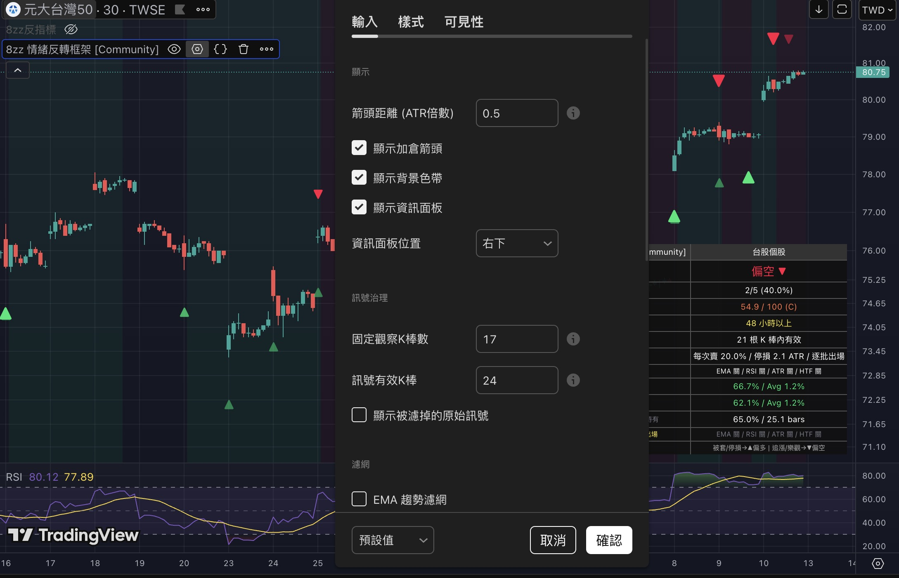

# 8zz 情緒反轉框架 | Community Edition

> **免責聲明：本指標僅供娛樂參考，不構成任何投資建議。**
>  
> © hansai-art | [Mozilla Public License 2.0](https://mozilla.org/MPL/2.0/)

---

## 專案定位

這個專案已從單純的「迷因反指標」升級為 **社群情緒反轉框架（Community Edition）**。

核心定位不再只是「她買我反著做」，而是：

- **社群情緒**：以公開貼文事件作為情緒觸發點
- **市場結構**：加入趨勢、動能、波動與高週期濾網
- **風險管理**：提供倉位、停損 ATR 與訊號有效期建議

---

## Community Edition 已實作內容

### 1. 訊號治理

- 事件翻轉訊號 ▲ / ▼
- 同向加碼訊號
- **訊號品質分數（0~100）**
- **A / B / C / D 品質等級**
- **訊號有效 K 棒倒數**
- 訊號過期後自動退出有效狀態

### 2. 市場條件濾網

可自由開關以下濾網：

- **EMA 趨勢濾網**：只放行與當前趨勢方向一致的訊號
- **RSI 動能濾網**：只放行站上 / 跌破 50 軸後的方向訊號
- **ATR 波動濾網**：市場波動不足時先不出手，避免低波動雜訊
- **高週期結構確認（HTF）**：用更高時間框架確認大方向是否一致

### 3. 執行層升級

- **標的類型設定**：ETF / 台股個股 / 美股個股 / 商品
- **建議倉位 (%)**
- **建議停損 ATR**
- **最大加碼次數**
- Tooltips 顯示品質分數、濾網結果與建議倉位

### 4. 統計面板升級

右上 / 右下 Premium-style Dashboard 顯示：

- 目前方向
- 倉位狀態
- 訊號品質
- 訊號年齡
- 訊號有效期
- 風控建議
- 濾網狀態
- 固定 N 棒勝率 / 平均報酬
- 翻轉平倉勝率 / 平均報酬
- 最近 20 筆翻轉結果
- 平均持有棒數

### 5. Alert 條件

已加入可建立 TradingView Alert 的條件：

- 多頭翻轉
- 空頭翻轉
- 同向加碼
- 原始事件遭濾網擋下
- 訊號失效

---

## 回測截圖（0050 · 1 小時線）


---

## 自動更新 Pipeline

> 此功能讓指標的事件庫在臺股與美股開盤時段全自動抓取並更新，**一天僅觸發約 11 次**，GitHub Actions 免費額度完全足夠。

### 架構圖

```
FB 公開貼文
    ↓ (facebook-scraper)
GitHub Actions 排程觸發
    ↓ (scripts/fetch_fb_events.py)
規則式情緒分類器
    ↓ (scripts/update_pine_script.py)
自動更新 8zz-indicator.pine → git push
    ↓
使用者取得最新版本（見下方三種方案）
```

### 排程規則

| 時段 | Cron (UTC) | 對應台灣時間 | 次數 |
|------|-----------|-------------|------|
| 臺股開盤 09:00–13:30 | `0,30 1,2,3,4,5 * * 1-5` | 週一～五每 30 分鐘 | 9次/天 |
| 美股開盤 09:30 EST | `30 14 * * 1-5` (標準時) / `30 13 * * 1-5` (夏令時) | 台灣時間 22:30 / 21:30 | 1次/天 |

### 如何取得最新版本

| 方案 | 說明 |
|------|------|
| **A（手動）** | 訂閱 GitHub Releases 通知，有新事件時去複製最新 `.pine` 貼入 TradingView |
| **B（半自動）** | 從 [Raw URL](https://raw.githubusercontent.com/hansai-art/8zz-Contrarian-Indicator-TradingView/main/8zz-indicator.pine) 直接載入腳本，之後每次開圖自動讀最新版 |
| **C（全自動 Pro）** | 後端爬到新事件後透過 TradingView Webhook Alert 直接推送訊號給訂閱者 |

### 啟用步驟（Repo Owner）

1. 至 GitHub Repo → **Settings → Secrets and variables → Actions** 新增：
   - `FB_PAGE_ID`：追蹤的公開 FB 頁面 ID 或 username
   - `FB_COOKIES`（選填）：若頁面需登入，填入 JSON 格式 cookie 字串
2. 確認 `.github/workflows/fetch-fb-events.yml` 已合併到 `main` branch
3. GitHub Actions 會依排程自動執行，有新事件時自動 commit & push

### 情緒分類規則（`scripts/fetch_fb_events.py`）

| 關鍵字（觸發即分類） | 方向 | 強度 |
|----------------------|------|------|
| 停損、認賠、虧損、畢業、爆倉 | 偏多 ▲ | ★★★ |
| 被套、跌停、房貸、住套房 | 偏多 ▲ | ★★★ |
| 賣出、停利、出場 | 偏多 ▲ | ★★☆ |
| 觀望、等、修正、怕 | 偏多 ▲ | ★☆☆ |
| 漲停買、漲停追、追漲 | 偏空 ▼ | ★★★ |
| 買進、加碼、補倉、看多 | 偏空 ▼ | ★★☆ |
| 持有、長期、慢慢漲 | 偏空 ▼ | ★☆☆ |

> 規則採**首次命中**（first-match wins），可在 `scripts/fetch_fb_events.py` 的 `SENTIMENT_RULES` 列表中調整優先順序與關鍵字。

---

## Community vs Paid 路線

| 模組 | Community Edition | Pro （規劃） | Elite （規劃） |
|------|-------------------|------------|---------------|
| 基礎翻轉訊號 | ✅ | ✅ | ✅ |
| 訊號品質分數 | ✅ | ✅ | ✅ |
| 濾網（EMA/RSI/ATR/HTF） | ✅ | ✅ 進階版 | ✅ |
| Premium Dashboard | ✅ 基礎版 | ✅ 完整版 | ✅ 完整版 |
| Alert 條件 | ✅ | ✅ 進階告警組 | ✅ |
| 完整事件庫 | ❌ | ✅ | ✅ |
| 即時更新資料 | ❌ | ✅ | ✅ |
| 多市場專屬權重 | ❌ | ✅ | ✅ |
| 策略回測版 | ❌ | ✅ | ✅ |
| 每週研究 / 社群解讀 | ❌ | ❌ | ✅ |
| 教學與案例庫 | ❌ | ❌ | ✅ |


---

## 目前指標邏輯

```text
1. 她買進 / 加碼 / 被套 / 看多  →  框架偏空 ▼
2. 她停損 / 賣出 / 畢業 / 認賠  →  框架偏多 ▲
3. 原始事件先進入品質評分
4. 再由 EMA / RSI / ATR / HTF 濾網決定是否放行
5. 放行後才更新有效訊號、加碼狀態與統計
6. 訊號在設定的有效 K 棒內有效，超時則失效
```

---

## 參數設定

### 顯示

| 參數 | 預設 | 說明 |
|------|------|------|
| 箭頭距離 (ATR倍數) | `0.5` | 箭頭與 K 棒距離 |
| 顯示加倉箭頭 | `開` | 同方向訊號顯示額外箭頭 |
| 顯示背景色帶 | `開` | 有效訊號期間顯示偏多 / 偏空背景 |
| 顯示資訊面板 | `開` | 顯示進階統計面板 |
| 資訊面板位置 | `右下` | 可切換右上 |

### 訊號治理

| 參數 | 預設 | 說明 |
|------|------|------|
| 固定觀察K棒數 | `8` | 模式 A：固定 N 棒統計 |
| 訊號有效K棒 | `24` | 超過後視為過期 |
| 顯示被濾掉的原始訊號 | `關` | 可視化被阻擋的原始事件 |

### 濾網

| 參數 | 預設 | 說明 |
|------|------|------|
| EMA 趨勢濾網 | `開` | 使用趨勢方向過濾 |
| RSI 動能濾網 | `關` | 使用 RSI 50 上下過濾 |
| ATR 波動濾網 | `關` | 使用 ATR 波動率過濾 |
| 高週期結構確認 | `關` | 使用更高週期方向確認 |
| 確認週期 | `240` | 預設 4H |

### 執行

| 參數 | 預設 | 說明 |
|------|------|------|
| 標的類型 | `台股個股` | 影響分數偏移與停損建議 |
| 基礎建議倉位 (%) | `20` | 用於品質分數換算建議倉位 |
| 最大加碼次數 | `5` | 同方向最多加碼次數 |



---

## 框架升級

- 把公開版重新包裝成 **Community Edition**
- 把價值從「迷因」拉到 **情緒 + 結構 + 風控**
- 把單點訊號升級成 **帶濾網、可告警、可解讀** 的工具
- 把 Dashboard 往付費產品體驗靠近

---

## 安裝方式

### 方法一：直接從 TradingView 新增

1. 在 TradingView 圖表頁開啟「指標」
2. 將本專案腳本貼入 Pine Script 編輯器
3. 儲存後加入圖表
4. 建議優先使用分鐘 / 小時等較細週期，較能反映事件時間差

### 方法二：手動貼上 Pine Script

1. 開啟 [TradingView](https://www.tradingview.com) → Pine Script 編輯器
2. 複製 [`8zz-indicator.pine`](./8zz-indicator.pine) 的全部內容
3. 貼入編輯器 → 儲存 → 加到圖表

---

## 檔案結構

```text
8zz-Contrarian-Indicator-TradingView/
├── 8zz-indicator.pine             ← Pine Script 指標（自動更新）
├── .github/
│   └── workflows/
│       └── fetch-fb-events.yml   ← GitHub Actions 排程工作流程
├── scripts/
│   ├── fetch_fb_events.py        ← FB 爬蟲 + 情緒分類器
│   ├── update_pine_script.py     ← Pine Script 自動更新器
│   └── requirements.txt          ← Python 依賴清單
├── data/
│   ├── last_event_timestamp.json ← 爬蟲狀態（避免重複插入）
│   └── new_events.json           ← 每次執行的暫存事件（腳本間傳遞）
├── assets/
│   ├── backtest-0050.jpg
│   ├── 001.jpg
│   ├── 002.jpg
│   └── 003.jpg
└── README.md
```

---

## 授權

本專案採用 [Mozilla Public License 2.0](https://mozilla.org/MPL/2.0/) 授權。
